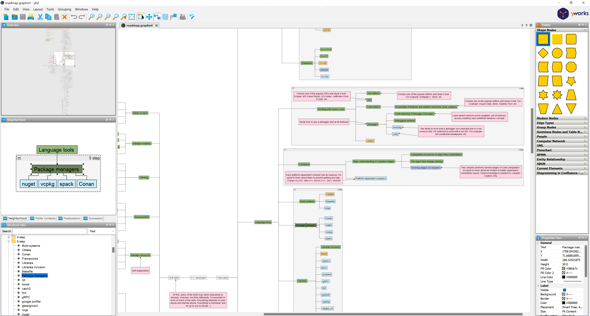

# How to view and modify the roadmap in graphML format

GraphML is an XML-based file format for graphs. It is supported by many applications for viewing it.

For example, you can use [yEd](https://www.yworks.com/products/yed) to view graphML file and modify it as you want.

*Last synced with Miro: 2023-02-17*

