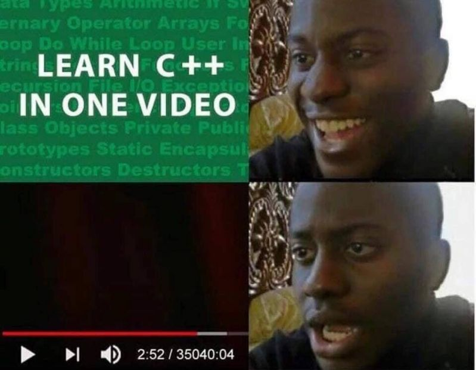
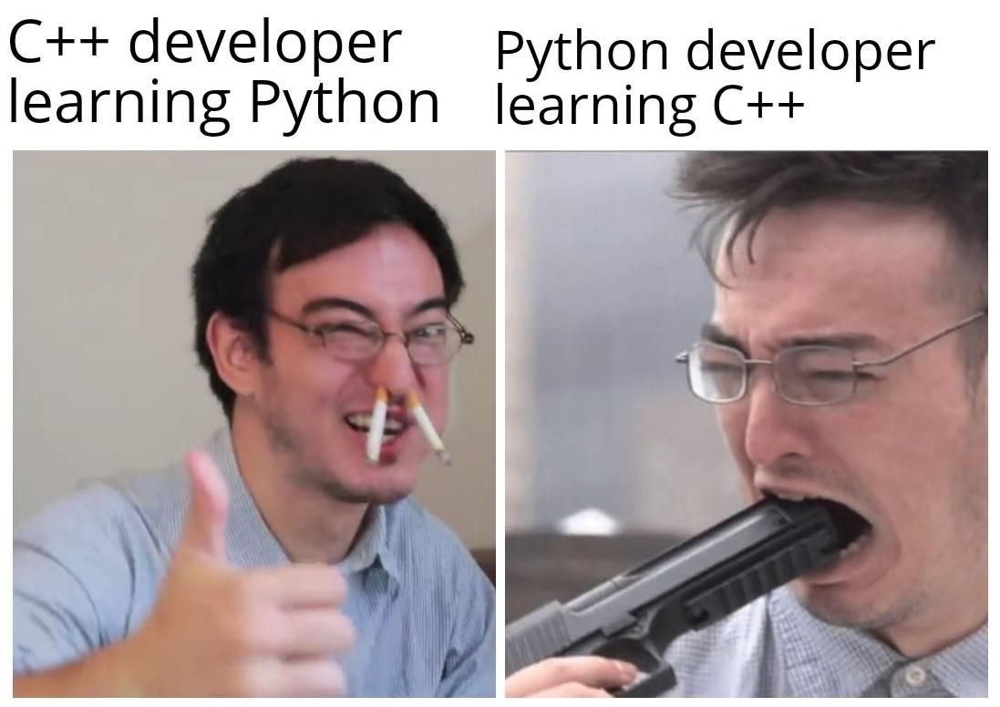

# А точно C++?

Первое, о чем действительно стоит подумать, прежде чем погружаться в изучение языка: а для чего он вам нужен?

Не смотрите на C++ в следующей парадигме: "Если вам дали в руки молоток, то всё вокруг становится гвоздями". Данный язык имеет конкретные ниши применения. Потому, прежде чем инвестировать свое время и силы в изучение - попробуйте поискать и погрузиться в сферы применения языка и найти ту, которая заинтересует именно вас. Вот некоторый ряд причин, почему это стоит сделать "на берегу":

- Многие сферы разработки выглядят несколько иначе, в отличие от их романтизированного образа. Например, популярное направление среди новичков - разработка игр, имеет следующие темные стороны: кранчи (переработки в режиме - живем в офисе следующие полгода), отсутствие внятного менеджмента, работа в "стол"/на выброс и т.д. 

- Во многих сферах может быть также популярен иной инструментарий, языки программирования. Например, в машинном обучении наиболее распространен язык Python и специализированные библиотеки к нему.

Потому, стоит внимательно присмотреться к той сфере, о которой вы имеете только общее представление. Возможно она окажется не столь заманчивой/интересной после детального погружения. Потратьте немного времени в исследовании и поиске той сферы, которая вам действительно понравится.

Второе, на что хочется обратить внимание: язык C++ требует больших временных инвестиций, а также сильную мотивацию. Его не получится выучить по универсальной формуле: "24 часа", "7 дней", "1 месяц". Если вы видите книгу с подобным обещанием - выбросите её и забудьте о ней. Вам придется взять какой-либо общепризнанный "кирпич" и прочитать его целиком, выполняя упражнения. А потом ещё несколько "кирпичей" поменьше, чтобы освоить распростарненные практики и подходы. По-другому освоить C++ вряд ли получится. На YouTube есть неплохие записи лекций по C++, но информации из них вряд ли хватит, т.к. чтобы освоить язык до промышленного уровня владения.

**Вывод №1:** Если вы не уверены в своих силах, или не готовы к олдскульному методу обучения при помощи книг, то вам стоит сделать выбор в пользу более популярных языков программирования. В них вы также сможете найти массу интересных задач для себя в различных сферах. К сожалению, C++ - это не тот язык, который позволяет вольности.

# Я уже знаю C/Java/Python/etc., могу ли я сразу начать писать на C++?

У многих новичков складывается ощущение, что С++ изучается быстро и непринужденно по ряду следующих причин:
- наличие 1-2 семестра лекций в ВУЗе с выполнением лабораторных работ;
- знание языка Си или парадигмы "Си с классами";
- знание одного из ООП языков: Java, C#, etc.
- знание Python, JavaScript и других распространенных языков.

К сожалению, полученный выше опыт крайне тяжело масштабируется на промышленное примениние C++. Недостаточно просто послушать семестр лекций изучить Си/Python/etc. и сразу же отмасштабировать знания на C++. Почему же?

- Если говорить про образование в ВУЗах, чаще всего вам дается только базовый синтаксис языка, который позволит писать простенькие программки для выполнения несложных вычислений. Проще говоря - вас учат собрать калькулятор на коленке и не более. Данных знаний и навыков недостаточно, чтобы выжить в промышленном программировании.

- Если говорить о Си, он является подмножеством C++, но не раскрывает истинной идеи и сути C++. Есть популярное мнение, что сначала изучите Си, а потом переходите к плюсам. Так вот, скорее всего, это вам даже больше навредит на первых порах, а также породит путаницу между концепциями двух РАЗНЫХ языков. Ваша первостепенная задача - получить удовольствие от написания первых программ, а не следовать олдскульным канонам. Потому, если есть возможность проигнорировать Си, то просто сделайте это. Все необходимое для работы с подмножеством Си вы узнаете из книг по C++.

- Если же говорить об опыте в других языках: C++ - мультипарадигменный язык. Он содержит в себе сочетание разнообразных парадигм, таких как: процедурное, обобщенное, ООП и т.д. Это не значит, что полученный опыт в других языках можно смело выкидывать на помойку. Он облегчит понимание существующих концепций в плюсах, но не поможет уловить тонны нюансов и деталей.

**Вывод №2:** лучший совет, который здесь можно дать - забудьте всё, что вы знаете о других языках, и начните изучение C++ с чистого головой. :)

# Как учиться?

Главное, что нужно усвоить для себя - ВЫ и только ВЫ отвечате за себя, свое будущее и успех. Только вы заинтересованы стать профессионалом в выбранной вами сфере. Безусловно, вокруг вас полно людей, которые с радостью вам помогут советом, подсказкой или ответом на вопрос, но никто не придумает за вас конкретные задачи или программу обучения. Ваш лучший друг в этом деле - вы и Google. Учитесь учиться и искать ответы на возникающие вопросы. К счастью, ваше будущее в IT, исключительно в ваших руках и упорстве. Эта сфера награждает тех, кто упорно идет к своей цели. Удачи!