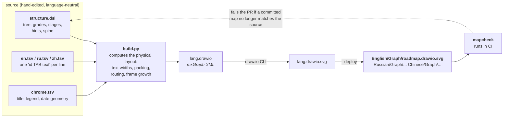
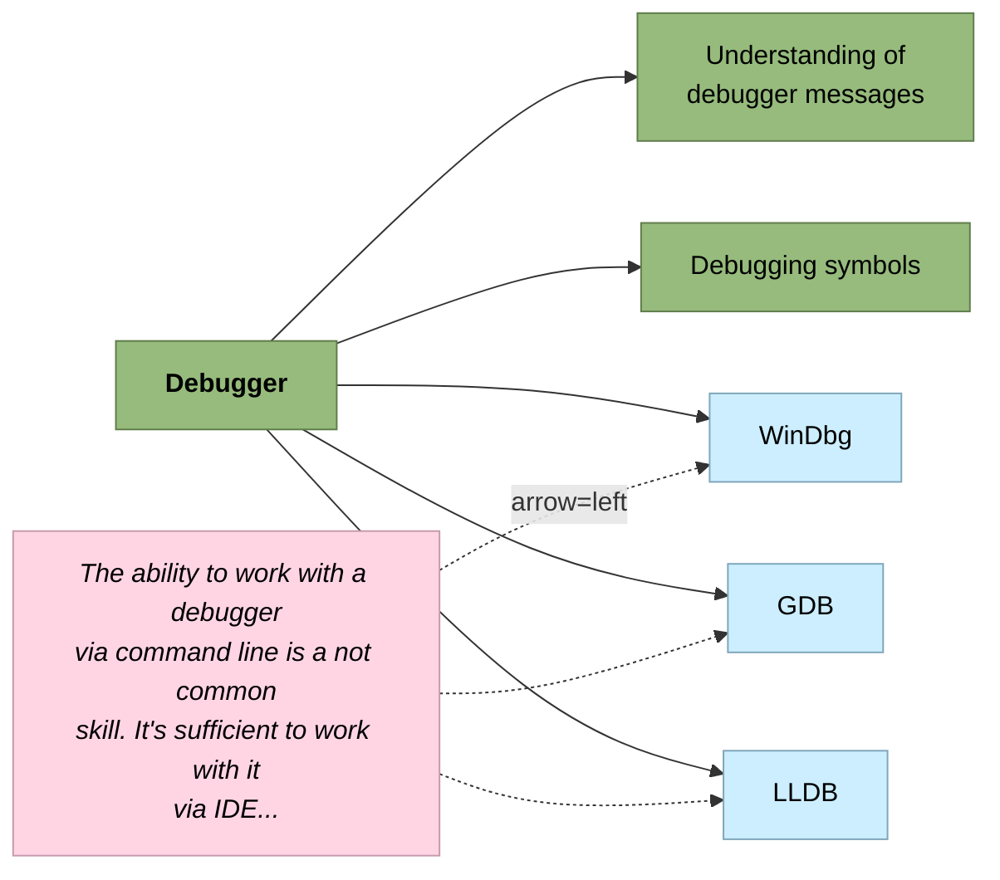

# mapgen — generate draw.io map fragments from a text DSL + translations

The roadmap map is maintained as a rigid text source plus per-language translation files,
with draw.io as the output format.

**Layout.** `roadmap/` holds the **real map source**: `structure.dsl` (the structure),
`en/ru/zh.tsv` (the words), and `chrome.tsv` (the title/legend/date blocks). `build.py`
turns those into `roadmap/<lang>.drawio.svg` — a gitignored build artifact — and
`--deploy` copies each one over its live map at `<Lang>/Graph/roadmap.drawio.svg`. The
rebuild is local (CI has no draw.io), but `mapcheck`'s map-vs-DSL check fails the PR if a
committed map has drifted from this source, so a forgotten rebuild is caught in review.

`roadmap/words.tsv` sits alongside them but is **not** build input — it is a bootstrap
bridge (word-id → the original EN draw.io id), used only by [`bootstrap/`](bootstrap/README.md).

## Why

The map had lived as three hand-maintained `.drawio.svg` files (RU/EN/ZH, soon +ES) — which
mapgen now generates. Two recurring pains motivated the switch:

- **Sync drift** — structural edits used to be ported RU→EN→ZH by hand, one map at a time.
- **Language-dependent width** — the same node is a different width per language, so
  positions can't simply be shared; a box that fits EN can clip ZH (the "C++26 box too
  narrow" class of bug).

Idea: keep **one** language-neutral structure, put the text in **per-language files**,
and **generate** the draw.io per language. The structure is fixed rigidly; only the
physical layout (x, width, routing, frame size) is computed per language.

## How it works



One source, three maps: the same `structure.dsl` is rendered once per language, so a
structural change lands everywhere at once and only the **text** is per-language.

The DSL fixes the **logical** layout (rows, order, grade, stage, hint targets, spine
sides). The generator computes the **physical** layout:

- **width** = measured text width (Pillow, the same library mapcheck uses) + padding, per language;
- **packing** — local: each child sits just right of its own parent (the left half
  mirrors, packing left), with a vertical bus in the gap carrying the parent→child edges;
  rows share `y` across languages (`PITCH=60`, box `H=30`);
- **hints** — wrapped to a fixed width and placed at an explicit polar offset (`angle`,
  `dist`) from their target; positions are authored in the DSL, not auto-laid-out;
- **frames** — grow to the bounding box of their members + a title band;
- **spine** — a central trunk the section roots hang off, both halves centred on the
  `center` node; hub-x is computed from the left half's width, so it shifts per language.

## Usage

### Setup (once)

```bash
python tools/mapgen/setup.py --venv
```

Creates `tools/mapgen/.venv`, installs Pillow into it, and verifies the two dependencies it
**cannot** install for you — a CJK-capable metrics font and the **draw.io desktop app** —
printing the right command for your OS (`winget` / `brew` / `snap`) when one is missing.
Drop `--venv` to install into the interpreter you ran it with; it warns if that isn't a
virtualenv. Exits non-zero while anything is still missing, so it is safe in a script.

Only the *rendering* needs draw.io: you can edit `structure.dsl` / the tsvs with nothing
installed, open a PR, and a maintainer regenerates the maps.

### Build

```bash
python tools/mapgen/build.py --dir tools/mapgen/roadmap --deploy --check
```

That one command is the whole edit loop: build all three languages, copy each map over its
live `<Lang>/Graph/roadmap.drawio.svg` (`--deploy`), then run `mapcheck` (`--check`, exits
non-zero on a hard error). `--check` validates the *live* maps, so without `--deploy` it
reports on the committed ones rather than what was just built — it says which.

**Dependency checks are not optional** and run before anything is built: Pillow, a metrics
font, the draw.io CLI, `structure.dsl` and every `<lang>.tsv`. All problems are reported at
once with install hints, so a missing dependency — or a virtualenv you forgot to activate —
surfaces immediately instead of after a slow build. Drop `--deploy` to leave the output next
to the source and inspect it first.

`--dir` holds `structure.dsl` and one `<lang>.tsv` per language. Output `<lang>.drawio` +
`<lang>.drawio.svg` land next to them (override with `--outdir`). The `.drawio` is a real
draw.io file — open it to inspect, but edits there are lost on regeneration (see Caveats).

Flags: `--langs en,ru,zh`, `--deploy`, `--check`, `--outdir <dir>`, `--repo-root <dir>`,
`--drawio-cli <path>`, `--font <path>` (metrics font, default `msyh.ttc` / Noto CJK),
`--font-family "<name>"` (written into the map). The draw.io CLI and the font are
autodetected per platform (Windows/macOS/Linux) and via `PATH`.

**Tests:** `python tools/mapgen/test_build.py` covers the deterministic pieces — the DSL
parser (attributes + side/stage inheritance), text wrapping, coordinate formatting, and the
hint geometry/arrow math — with no draw.io or Pillow needed (metrics are injected). It runs
in CI. The layout functions (`assign_y`/`layout_x`/centering) live inside `build_lang` and
aren't unit-tested yet; the map-level guard for those is `mapcheck` (overlaps + map-vs-DSL).

## DSL grammar

A line-based text format. `#` starts a comment. Blank lines ignored.

### A complete, minimal map

Everything below is optional detail; this is a whole working source. Two files — the
structure, and the words for one language:

```
# structure.dsl
spine center=me

[fundamentals] side=right grade=junior stage=1
  [syntax] grade=junior
  [pointers] grade=middle
[tooling] side=left grade=junior stage=1
  [debugger] grade=junior
  [profiler] grade=optional

hint [start-here] angle=90 dist=140 arrow=bottom -> syntax
```

```
# en.tsv   (id, then a TAB, then the text)
me	Me
fundamentals	Fundamentals
syntax	Syntax
pointers	Pointers
tooling	Tooling
debugger	Debugger
profiler	Profiler
start-here	Start here, then work outwards.
stage1	1 step
```

```bash
python tools/mapgen/build.py --dir path/to/that/folder --langs en
```

Note `stage1` in the tsv: stage frames take their title from the `stage1`..`stage5` keys.
Add `ru.tsv` / `zh.tsv` with the same ids and `--langs en,ru,zh` renders all three.

### What the DSL renders as

A worked example — this is the real `Debugger` branch. Six source lines plus a hint:

```
      [debugger] grade=junior
        [understanding-of-debugger-messages] grade=junior
        [debugging-symbols] grade=junior
        [windbg] grade=optional
        [gdb] grade=optional
        [lldb] grade=optional

hint [the-ability-to-work] angle=3 dist=464 arrow=left -> windbg, gdb, lldb
```

...become this (colours are the real grade palette; the dashed arrows are the hint):



Reading it back:

| in the DSL | in the map |
|---|---|
| indentation | parent → child; children stack downward next to their parent |
| `[debugger]` | the **id**, never the label — the text comes from the tsvs: `Debugger` (en), `Отладчик` (ru), `调试器（Debugger）` (zh) |
| `grade=optional` | the box's fill colour (light blue here) |
| `stage=3` on an ancestor | the whole subtree lands in the grey "3 step" frame |
| `hint [...] -> a, b, c` | one pink box with a curved arrow to each target |
| `angle` / `dist` | where that pink box sits relative to its targets |

**To add a leaf** you touch two files: one indented `[my-new-node] grade=middle` line in
`structure.dsl`, and one `my-new-node<TAB>My New Node` row in **each** of `en.tsv`,
`ru.tsv`, `zh.tsv`. Everything else — x position, box width per language, the parent edge,
frame growth — is computed. Rebuild, and it appears in all three maps.

### Nodes (indentation = hierarchy, 2 spaces per level)

```
[basic-operations] grade=junior stage=1
  [arithmetic-operations] grade=optional
    [loops-for-while] grade=middle
```

- `[id]` — a **word-id** (a short slug of the English name, e.g. `standard-library-stl`),
  stable and language-neutral; the display text comes from `<lang>.tsv` (`id <TAB> text`).
  Word-ids are the same key in every language, so translations can't drift apart the way
  the maps' native numeric draw.io ids did (see "Cross-language id alignment").
- `grade` — colour class: `junior` `#96BB7C`, `middle` `#FAD586`, `senior` `#BBCCEE`,
  `optional` `#CCEEFF` (matches the map legend). Defaults to `junior`.
- `stage` — maturity band (1–5), inherited by the subtree (like `side`). Consecutive
  same-stage subtrees within a section are wrapped by a grow-to-fit stage frame. Only the
  shallowest node of each band needs the annotation.
- `side` — `left` or `right`: which half of the spine the node hangs off, **inherited by
  the whole subtree** (default `right`). Normally set once on a depth-0 root; see Spine below.
- Depth-0 nodes are section roots (placed on the spine — see below).

### Hints — `hint [id] angle=<deg> dist=<px> arrow=<side> -> target, target, ...`

A pink annotation box, text from `<lang>.tsv` (auto-wrapped, CJK-aware), with a curved
arrow to each target. The box is placed at a **polar offset** from the mean target centre:
`angle` degrees (0 = right, 90 = up) and `dist` pixels. Example:

```
hint [the-ability-to-work] angle=3 dist=464 arrow=left -> windbg, gdb, lldb
```

`arrow=left|right|top|bottom` is **required** — it sets which box edge the arrow **starts**
from (e.g. a note above its target uses `arrow=bottom`). The arrow always ends on the target
edge facing the box. `extract.py` seeds it from the box's position (the edge facing the
target); the build fails if any hint omits it.

Placement is **explicit, not auto-laid-out** — the generator just puts the box where the
coords say. The initial `angle`/`dist` were seeded from the hand map during bootstrap, so
the notes replay in their hand-tuned positions; you nudge the values by hand in
`structure.dsl` (the source of truth) when a note needs to move. Rows are shared across languages so an offset
transfers; only the target's x shifts with per-language width, carrying the box along.
Because box heights and node widths differ per language, one `angle`/`dist` has to clear
all three — nudge the values until `mapcheck` reports no overlaps. If omitted, the box
defaults to straight right of its target (`angle=0`), with no overlap avoidance.

### Stage frames — automatic from `stage=`

Nodes carrying a `stage=N` (inherited by the subtree) are wrapped in a grey `#F5F5F5`
box grown to fit, one per **(section, stage)** group — the same banding the hand-drawn
map uses. Titles come from the `stage1`..`stage5` tsv keys (`1 step` / `1 этап` / `步骤 1`).
A gap is inserted between stage bands so the boxes don't touch. No directive is needed —
just annotate the subtree roots.

### Explicit frames — `frame [id] title=<key> [contains=a,b]`

A box drawn behind the nodes, grown to fit. `title` is a translation key. Without
`contains`, it encloses everything; with it, only those roots' subtrees.

```
frame [libs] title=libraries contains=boost,opencv
```

### Spine — `spine [center=<id>] [hubx=<x>] [gate=<x>] [header=<key>]`

A central trunk; depth-0 nodes become sections hanging off it. Each root is placed on a
side with `side=left|right` (inherited by its subtree, default `right`): the right half
packs rightward from the trunk, the left half packs leftward (mirror). Nodes use **local
packing** — each child sits just right of its own parent — so deep trees stay compact.

- **`center=<id>`** puts a node on the trunk at the vertical middle and centres both halves
  on it (the "C++ developer" node the two halves emanate from). The two halves stack
  top-down in parallel.
- **hub-x is computed** from the left half's actual width when `hubx` is omitted — wider
  labels in one language push the whole centre right, per language. Pass `hubx` to pin it.
- Optional `gate`/`header` draw a dashed gate guide + a left-of-gate header.

```
spine center=cpp-developer     # bilateral, centre node, computed hub-x
[soft-skills] side=left
  [ability-to-learn]           # subtree inherits side=left
[hard-skills] side=right
  [language-syntax]            # subtree inherits side=right

spine hubx=460 gate=420 header=hardskills   # optional: pinned hub-x + dashed gate guide
```

## Translation files `<lang>.tsv`

One `id <TAB> text` per line, UTF-8 (no BOM). A missing id falls back to the id itself.
Keys include node ids, chrome roles, and any `frame` title / `spine` header keys.

## Bootstrapping the source

`roadmap/` was reverse-engineered from the original hand-drawn maps — the EN map becomes the
word-id `structure.dsl` + `en.tsv` + `words.tsv` + `chrome.tsv`; ZH and RU are keyed onto the
same word-ids. That's a one-off; the tools live in [`bootstrap/`](bootstrap/README.md) and
are also how a new language is onboarded. **Going forward the DSL is the source — edit
`structure.dsl` / `<lang>.tsv` directly, never re-derive from a generated map.**

For reference, `roadmap/` holds the canonical `structure.dsl` (394 nodes + 34 hints + 25
stage annotations), `chrome.tsv` (18 static blocks: title, legend, About/How-to/Feedback,
repo link, date), `en/ru/zh.tsv`, and `words.tsv`.

## What generates

The whole map, all three languages, from the canonical source: skill tree, hints, stage
frames (from `stage=`), and the top-left chrome — title banner, legend,
About/How-to/Feedback, repo link, date. Chrome layout is captured once in `chrome.tsv`
(language-neutral geometry + style); text is per-language in `<lang>.tsv`. RU is re-keyed
onto EN's word-ids by `remap.py` (validated clean); EN and ZH share ids natively. Validated
by `mapcheck` — box-fits-text, overlaps, cross-language drift, and a **map-vs-DSL** check
that fails CI if a committed map no longer matches this source (ids, grades, `<lang>.tsv`
text) or a translation is missing.

## Caveats & remaining work

- **No round-trip.** draw.io stays the *output*; hand-edits to a generated `.drawio.svg`
  are lost on regeneration. Edit `structure.dsl` / `<lang>.tsv`, never the output.
- **The rebuild is local, not CI.** CI can't build (no draw.io there), so run
  `build.py --deploy` yourself and commit the regenerated maps. `mapcheck`'s map-vs-DSL
  check fails if the committed maps don't match the DSL/tsv — so a forgotten rebuild is
  caught in review rather than shipping silently.
- **Per-language hint tuning.** One `angle`/`dist` per hint must clear all three languages
  (see the Hints section).
- **Metrics font.** Text is measured with Pillow using `Microsoft YaHei` (Latin+Cyrillic+CJK;
  falls back to Noto CJK) while draw.io renders Latin in Helvetica, so generated widths aren't
  pixel-identical to what draw.io lays out — mapcheck's relative margin absorbs the difference.
  The draw.io CLI path defaults to the Windows install; pass `--drawio-cli` elsewhere.

See [AGENTS.md](../../AGENTS.md) for the agent/contributor workflow and the map conventions
the generator follows (colour legend, stage frames, the "Last updated" date).
