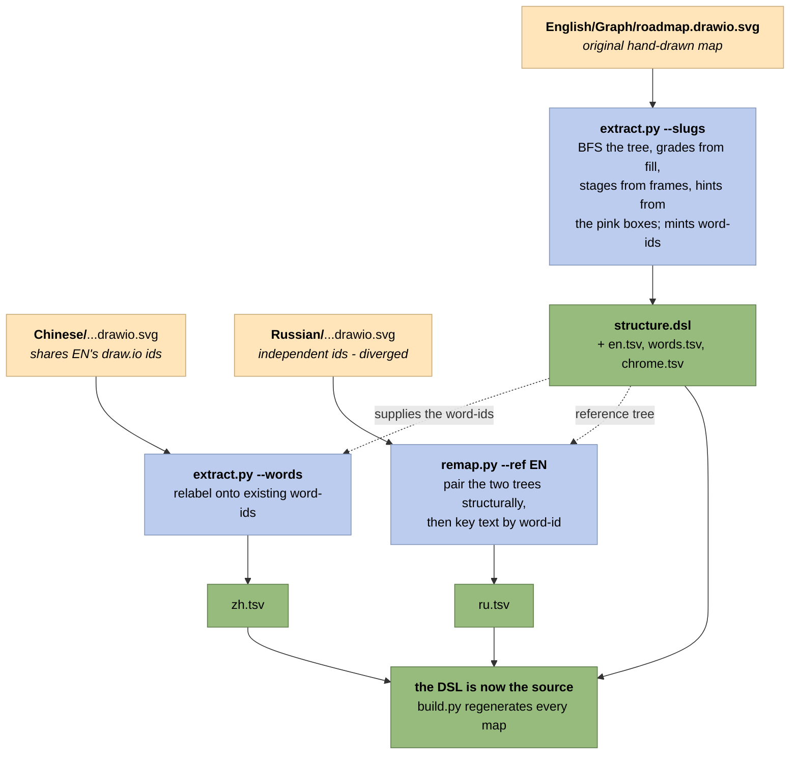

# mapgen/bootstrap — reverse-engineer a hand-drawn map into the DSL

One-off helpers, **not part of the build**. The map's source of truth is
`tools/mapgen/roadmap/structure.dsl` + `<lang>.tsv` — edit those and run `build.py`.
These tools *derived* that source from the original hand-drawn `.drawio.svg` maps, and are
kept for two jobs:

- **Onboarding a new language** — pull a hand-drawn map's text onto the existing word-ids.
- **Re-deriving / re-verifying** the source if a hand map is ever corrected.

Requires Python 3. `remap.py` imports `extract.py`, so keep them in the same folder.

## The one-off derivation, in one picture

How the canonical source was produced — a job already done. Solid arrows are the data
flow; dashed ones show the EN result feeding the other two languages. Word-ids are minted
from the **EN** map and every other language is keyed onto those same ids, which is what
stops the three translations drifting apart:



**The arrows only ever point this way once.** After bootstrap the direction reverses: the
DSL generates the maps, and re-running these tools against a generated map would be
circular. That is why they live here and not in the build.

## extract.py — map → `structure.dsl` + `<lang>.tsv`

Reverses a `roadmap.drawio.svg`: BFS tree from the centre/left/right anchors, grades from
fill, `stage` from the `#F5F5F5` frames, pink boxes → hints (with polar `angle`/`dist`
seeded from the box's position), and the top-left chrome; handles link-bearing `UserObject`
nodes.

The canonical structure is built from the **EN** map with `--slugs`, which assigns the
word-ids and writes a `words.tsv` bridge (word → EN numeric id). Other languages key onto
those same word-ids — ZH shares EN's numeric ids so it is relabelled directly; RU used
independent ids so it goes through `remap.py`:

```bash
# reference: word-id structure.dsl + en.tsv + words.tsv + chrome.tsv (+ stage annotations)
python tools/mapgen/bootstrap/extract.py English/Graph/roadmap.drawio.svg -o tools/mapgen/roadmap --lang en --slugs
# ZH shares EN's ids -> relabel text (--words) + match chrome by id (--chrome)
python tools/mapgen/bootstrap/extract.py Chinese/Graph/roadmap.drawio.svg -o tools/mapgen/roadmap --lang zh --words tools/mapgen/roadmap/words.tsv --chrome tools/mapgen/roadmap/chrome.tsv
# RU diverged -> align + key by word (--words) + match chrome by position (--chrome)
python tools/mapgen/bootstrap/remap.py --ref English/Graph/roadmap.drawio.svg --target Russian/Graph/roadmap.drawio.svg -o tools/mapgen/roadmap --lang ru --words tools/mapgen/roadmap/words.tsv --chrome tools/mapgen/roadmap/chrome.tsv
```

**Cross-language id alignment (why word-ids were needed).** Measured by extracting all three
maps:

- **EN and ZH share the draw.io id scheme** — identical topology and grades for every shared
  id; ZH only lacks two nodes EN has (`n922`, `n923`). So ZH text maps straight onto the
  word-ids via `words.tsv`.
- **RU used independent ids** — the same numeric id meant a *different* node (e.g. `354` is
  "Process" in EN but "Асинхронные" in RU's own map). `remap.py` aligns RU to EN
  structurally and keys its text by word-id. It also writes a `<lang>.remap.tsv`
  recording the RU-numeric → EN-numeric pairing, as an audit trail for eyeballing the
  result — that file is regenerable output and is not committed.

## remap.py — re-key a divergent map onto the canonical ids

When a map was drawn with independent ids (RU), `remap.py` aligns it to a reference map and
rewrites its `<lang>.tsv` to the reference word-ids — drop-in for `structure.dsl`:

```bash
python tools/mapgen/bootstrap/remap.py --ref English/Graph/roadmap.drawio.svg \
    --target Russian/Graph/roadmap.drawio.svg -o tools/mapgen/roadmap --lang ru
```

Both maps reconstruct to the same rooted tree (they describe the same roadmap), so children
are paired in `(y, x)` order. Correctness is cross-checked three ways: **topology** (child
counts must match at every node, else it aborts), **grade** (paired nodes must share a
colour — a signal independent of position; RU came out 395/395), and **semantic** (paired
texts are translations — eyeball `<lang>.remap.tsv`). Hints are matched by their translated
target-set. The RU re-key ran clean: 0 topology mismatches, 0 grade mismatches, 34/34 hints,
164 ids re-keyed.

## Adding a new language (e.g. ES)

1. Draw or obtain the map as `Spanish/Graph/roadmap.drawio.svg`.
2. If it shares EN's draw.io ids, run `extract.py … --lang es --words …/words.tsv
   --chrome …/chrome.tsv`; if its ids diverged, run `remap.py …` the same way. Either writes
   `roadmap/es.tsv` keyed to the canonical word-ids.
3. Add `es` to `build.py --langs` and rebuild.

Re-running against a corrected hand map **overwrites** the tsv — fold changes back
deliberately, since `structure.dsl` + `<lang>.tsv` are the source of truth now, not the map.
